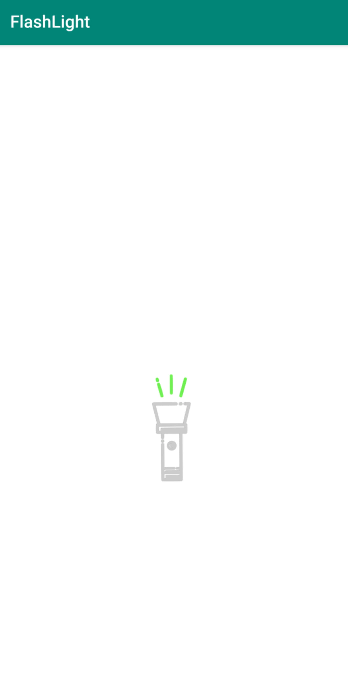

# FlashLight

 
This is a simple and pure flashlight application that runs on the Android system without ads.
 

  

## Screenshots

## Notice
The icon of APP is designed by <a href="https://pixabay.com/users/Pettycon-3307648/?utm_source=link-attribution&amp;utm_medium=referral&amp;utm_campaign=image&amp;utm_content=1849092">Pettycon</a> from <a href="https://pixabay.com/?utm_source=link-attribution&amp;utm_medium=referral&amp;utm_campaign=image&amp;utm_content=1849092">Pixabay</a>, it's free for commercial use.

## License
MIT License

Copyright (c) 2020 SymeonChen

